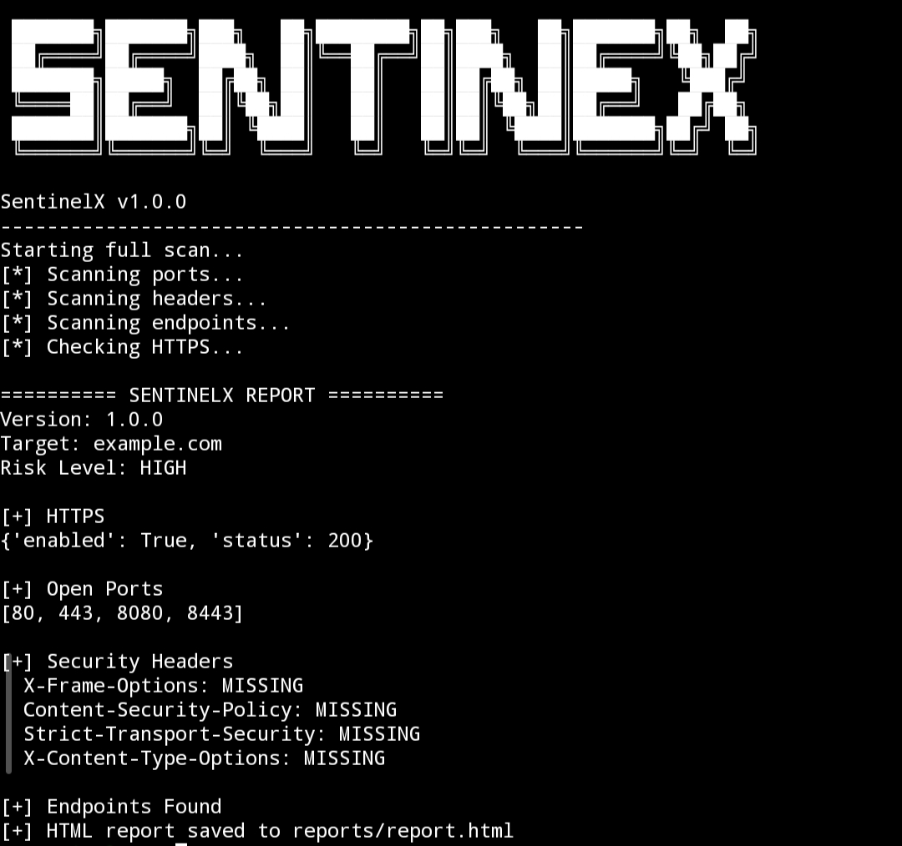

# SentinelX2

**SentinelX2** is a modular, beginner-friendly **web security scanner** built in Python.  
It performs **port scanning, endpoint discovery, security header checks, HTTPS detection**, and generates clean reports.

This tool is **designed for learning and ethical security reconnaissance**.

---

## 🚀 Features

- ✅ Port scanning of common ports  
- ✅ Endpoint discovery with optional **deep scan mode** (`--deep`)  
- ✅ Security headers analysis  
- ✅ HTTPS detection  
- ✅ Modular, clean architecture  
- ✅ HTML report generation (saved in `reports/`)  
- ✅ Terminal report with risk scoring  
- ✅ Banner + version display  

---

## ⚙️ Installation

```bash
# Clone the repository
git clone https://github.com/sam10001863/SentinelX2.git
cd SentinelX2

# Install dependencies
pip install requests colorama

## 💻 Usage

# Normal scan
python sentinelx2.py <target>

# Deep scan
python sentinelx2.py <target> --deep

### Example:
python sentinelx2.py example.com --deep

## 🖼 Screenshot

### Terminal Output


> Shows banner, open ports, security headers, endpoints, and risk level.
